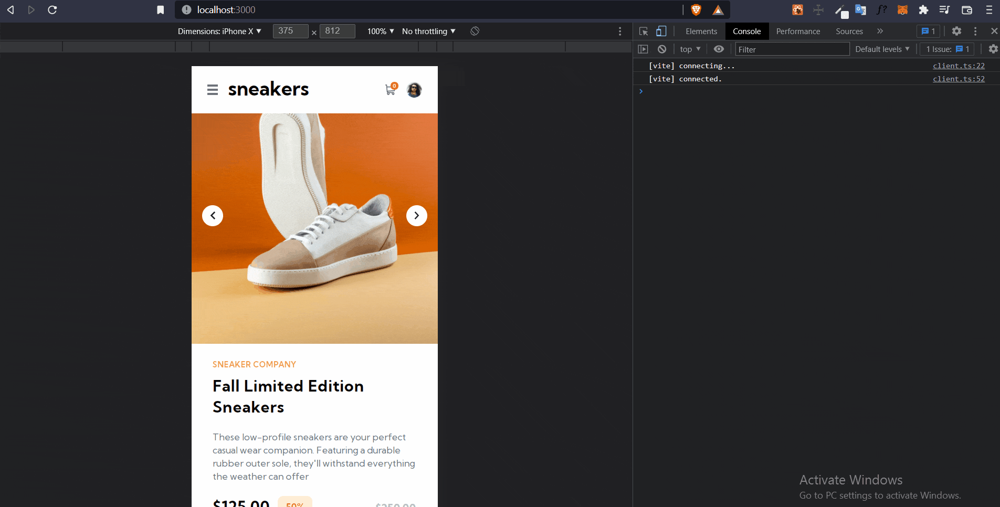

# Frontend Mentor - E-commerce product page solution

This is a solution to the [E-commerce product page challenge on Frontend Mentor](https://www.frontendmentor.io/challenges/ecommerce-product-page-UPsZ9MJp6). Frontend Mentor challenges help you improve your coding skills by building realistic projects.

## Table of contents

- [Overview](#overview)
  - [The challenge](#the-challenge)
  - [Screenshot](#screenshot)
  - [Links](#links)
- [My process](#my-process)
  - [Built with](#built-with)
  - [What I learned](#what-i-learned)
- [Author](#author)

**Note: Delete this note and update the table of contents based on what sections you keep.**

## Overview

### The challenge

Users should be able to:

- View the optimal layout for the site depending on their device's screen size
- See hover states for all interactive elements on the page
- Open a lightbox gallery by clicking on the large product image
- Switch the large product image by clicking on the small thumbnail images
- Add items to the cart
- View the cart and remove items from it

### Screenshot

### Links

- Solution URL: [Add solution URL here](https://github.com/Chijioke91/ecommerce-app-frontend-mentor)
- Live Site URL: [Add live site URL here](https://cj-commerce-app.vercel.app/)

## My process

### Built with

- [Vite](https://vitejs.dev/)
- [TailwindCSS](https://tailwindcss.com/)
- [React](https://reactjs.org/) - JS library

### What I learned

Updated my knowledge of working with states and sharing it across components using Context API and useReducer Hook. More like what you'd generally do with Redux.

## Author

- Website - [Godis Agu](https://godisagu.netlify.app/)
- Frontend Mentor - [@Chijioke91](https://www.frontendmentor.io/profile/yourusername)
- Twitter - [@dev_cjay](https://www.twitter.com/dev_cjay)
